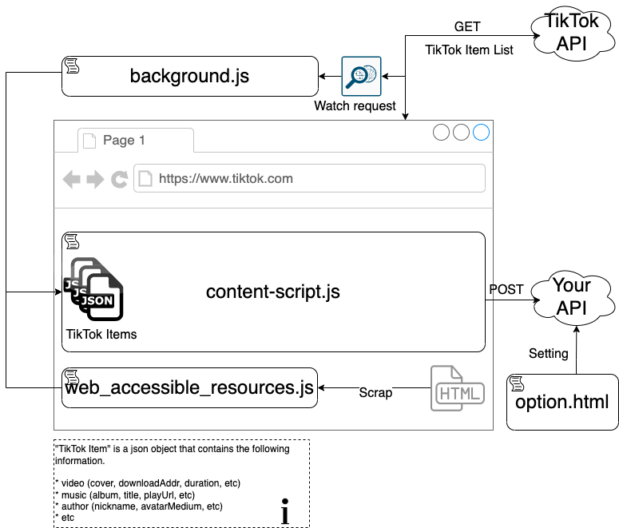

# chrome-extensions-tiktok-scraping-downloader

## What's this

This is a Chrome extensions that scrapes and posts Tiktok web pages.

## Motivation

I'm Tik Tok Lover. TikTok does not provide an official API. Therefore, there are various unofficial TikTok APIs such as:

* https://github.com/davidteather/TikTok-Api
* https://github.com/drawrowfly/tiktok-scraper

These APIs are great OSSs that meet my needs. However, if the changes on the TikTok side (especially authentication) occurs, these OSSs will not work well. Thanks to the efforts of the OSS developers, the unofficial API works fine, but it's a cat-and-mouse game.

So, for stability, I came up with a way to scrape [TikTok web page](https://www.tiktok.com) from Chrome extensions. That is this repository.

## System Structure

One video posted by TikTok is called a `TikTok Item`.
On the TikTok web page, there are two ways to get a TikTok Item.

* First
    * First render, set TikTok Item on window object.
* Second and subsequent
    * Due to lazy loading, request to TikTok API to get TikTok Item and render.

To get these TikTok Item from the Chrome extensions, I have the following configuration.



* First
  * web_accessible_resources.js accesses the window object and gets a TikTok Item.
* Second and subsequent
  * background.js monitor requests to the TikTok API and get the request URL. Get TikTok Item using URL.

The obtained TikTok Item will be POST from content-script.js to the URL you specify. The data is set in a variable called `data`.

## Usage

1. Load this repository as a Chrome extensions.
    1. see https://developer.chrome.com/docs/extensions/mv3/getstarted/
1. Go to the Option page and set your server URL.
    1. Otherwise, it will be `http://localhost:3000`.
        1. In that case, let's start the local [server](./server).
1. Open the [TikTok web page](https://www.tiktok.com) in your Chrome browser.
    1. Tiktok Item will be POSTed to your server!


## Notes

Make sure you run it with chrome incognito!
This is because it will not work under the influence of other chrome exteions.

### Zip

```
$ zip -r tiktok-scraper-chrome-extension.zip \
  ./chrome-extension-tiktok-downloader/ \
  -x './chrome-extension-tiktok-downloader/server/*' \
  -x './chrome-extension-tiktok-downloader/server_local/*' \
  -x './chrome-extension-tiktok-downloader/web/*' \
  -x './chrome-extension-tiktok-downloader/.git/*' \
  -x './chrome-extension-tiktok-downloader/web/*' \
  -x './chrome-extension-tiktok-downloader/*.md' \
  -x './chrome-extension-tiktok-downloader/.DS_Store' \
  -x './chrome-extension-tiktok-downloader/overview.*' \
  -x './chrome-extension-tiktok-downloader/LICENSE'
```
